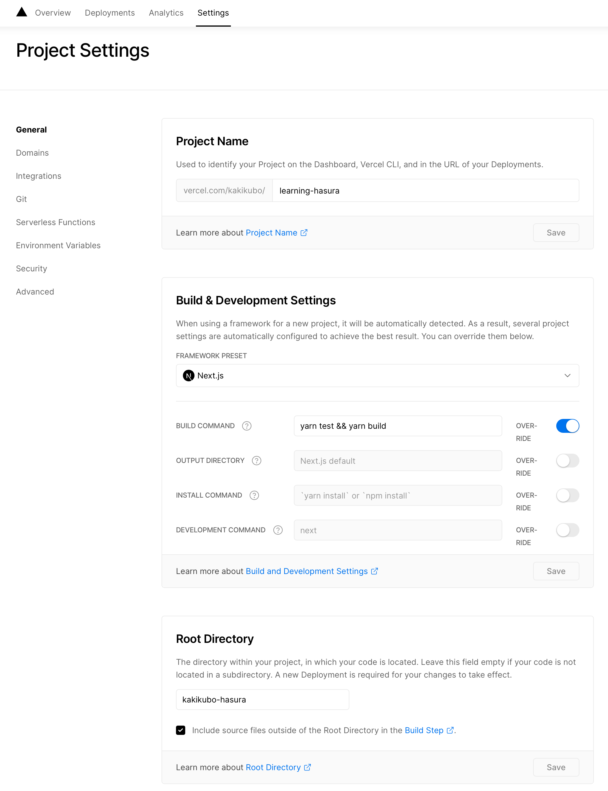

# learning-hasura

## プロジェクト概要

このプロジェクトは、GomaGoma676 氏のチュートリアル「Next.js + Hasura」を基にした学習記録です。開発環境のセットアップ手順や、その過程で発生した問題と解決策をまとめています。

- **参考チュートリアル**: [GomaGoma676/nextjs-hasura-basic-lesson](https://github.com/GomaGoma676/nextjs-hasura-basic-lesson)

## 技術スタック

- [Next.js](https://nextjs.org/)
- [Hasura](https://hasura.io/)
- [Apollo Client](https://www.apollographql.com/docs/react/)
- [TypeScript](https://www.typescriptlang.org/)
- [Tailwind CSS](https://tailwindcss.com/)
- [Jest](https://jestjs.io/)
- [React Testing Library](https://testing-library.com/docs/react-testing-library/intro/)
- [MSW (Mock Service Worker)](https://mswjs.io/)
- [GraphQL Code Generator](https://www.graphql-code-generator.com/)
- [Biome](https://biomejs.dev/) - 高速なリンター・フォーマッター
- [Lefthook](https://github.com/evilmartians/lefthook) - Gitフック管理
- [pnpm](https://pnpm.io/)

> **📝 Note**: このプロジェクトは2025年にESLintとPrettierからBiomeに移行しました。詳細は[Biome移行ガイド](./BIOME_MIGRATION.md)を参照してください。

## コード品質ツール

このプロジェクトでは、コード品質を維持するために[Biome](https://biomejs.dev/)を使用しています。

### 利用可能なコマンド

```bash
# リンティングチェック（修正なし）
pnpm lint:check

# リンティングチェックと自動修正
pnpm lint

# Biomeでフォーマット
pnpm format

# Biomeでフォーマットチェックのみ
pnpm format:check
```

### 自動チェック

- **Git hooks**: コミット前に自動的にBiomeチェックが実行されます（Lefthook経由）
- **CI/CD**: GitHub Actionsでプルリクエスト時に自動チェックが実行されます

詳細な使用方法とトラブルシューティングについては、[Biome移行ガイド](./BIOME_MIGRATION.md)を参照してください。

## セキュリティ

このプロジェクトでは、サプライチェーン攻撃から保護するために[safe-chain](https://github.com/AikidoSec/safe-chain)を使用しています。

### 利用可能なコマンド

```bash
# ローカル環境でsafe-chainをセットアップ（初回のみ）
pnpm security:setup

# その後、通常通りpnpm installを実行すると自動的に保護されます
pnpm install
```

### 自動チェック

- **CI/CD**: GitHub Actionsで依存関係インストール前に自動的にセキュリティチェックが実行されます
- 悪意あるパッケージやタイポスクワッティング攻撃を検出します

## セットアップ手順

### 1. Hasura バックエンドの構築

1. [Hasura Cloud](https://hasura.io/cloud/)にて、GitHub アカウントで認証し、新規プロジェクトを作成します。
2. Heroku と連携してデータベースインスタンスを構築します。
3. プロジェクトダッシュボード: [kakikubo-hasura](https://cloud.hasura.io/project/240cecde-58ae-4f75-a05f-1a3fc5b098d6/console/api/api-explorer)

### 2. Vercel へのデプロイ

1. [Vercel](https://vercel.com/)にご自身の GitHub アカウントを連携します。
2. プロジェクトのセットアップ時、以下の画像のように環境変数を設定します。



### 3. ローカル開発環境

#### 3.1. 初期設定

- **pnpm の有効化**:

```bash
corepack enable pnpm
```

- **Next.js アプリケーションの作成**:

```bash
npx create-next-app .
pnpm dev
```

- **環境変数の設定**:

ルートディレクトリに`.env.local`ファイルを作成し、以下の内容を記述します。このファイルは Git の追跡対象外です。

```bash
NEXT_PUBLIC_HASURA_KEY="YOUR_HASURA_ADMIN_SECRET"
NEXT_PUBLIC_HASURA_URL="YOUR_HASURA_GRAPHQL_API_URL"
```

その後、`lib/apolloClient.ts`がこれらの変数を読み込むように設定します。

#### 3.2. 依存パッケージのインストール

- **コアライブラリ**:

```bash
pnpm add @apollo/client graphql @apollo/react-hooks cross-fetch @heroicons/react
```

- **テスト関連ライブラリ**:

```bash
pnpm add -D msw@0.35.0 next-page-tester jest @testing-library/react @types/jest @testing-library/jest-dom @testing-library/dom babel-jest @babel/core @testing-library/user-event jest-css-modules
```

#### 3.3. 設定ファイル

- **Babel (`.babelrc`)**:

```json
{
  "presets": ["next/babel"]
}
```

- **Jest (`package.json`)**:

```json
"jest": {
    "testPathIgnorePatterns": [
        "<rootDir>/.next/",
        "<rootDir>/node_modules/"
    ],
    "moduleNameMapper": {
        "\\.(css)$": "<rootDir>/node_modules/jest-css-modules"
    }
},
"scripts": {
  "test": "jest --env=jsdom --verbose"
}
```

- **Biome (`biome.json`)**:

プロジェクトルートに`biome.json`が配置されています。リンティングとフォーマッティングの設定が含まれています。

#### 3.4. TypeScript の導入

1. 空の`tsconfig.json`を作成: `touch tsconfig.json`
2. TypeScript 関連の型定義をインストール:

   `pnpm add -D typescript @types/react @types/node`

3. `pnpm dev`を実行し、Next.js に`tsconfig.json`を自動生成させます。
4. `.js`ファイルを`.tsx`にリネームし、必要に応じて内容を修正します。

#### 3.5. Tailwind CSS の導入

1. Tailwind CSS 関連のパッケージをインストール:

```bash
pnpm add -D tailwindcss@latest postcss@latest autoprefixer@latest
```

2. 設定ファイルを生成:

```bash
npx tailwindcss init -p
```

3. `tailwind.config.js`を編集:

```js
module.exports = {
  content: [
    './pages/**/*.{js,ts,jsx,tsx}',
    './components/**/*.{js,ts,jsx,tsx}',
  ],
  theme: {
    extend: {},
  },
  plugins: [],
};
```

4. `styles/globals.css`を編集:

```css
@tailwind base;
@tailwind components;
@tailwind utilities;
```

#### 3.6. GraphQL Code Generation

1. codegen の CLI をインストール:

```bash
pnpm add -D @graphql-codegen/cli @graphql-codegen/typescript
```

2. 初期化ウィザードを実行:

```bash
pnpm graphql-codegen init
```

ウィザードの指示に従い、React アプリケーション向けの設定を行い、Hasura の GraphQL エンドポイントと出力先パスを指定します。

3. `queries/queries.ts`に GraphQL クエリを記述します。
4. 型定義を生成:

```bash
pnpm gen-types
```

### 4. Hasura スキーマの再現（リポジトリ管理）

Hasura のスキーマ（テーブル定義・トラッキング）は `hasura/` 配下に migrations / metadata として管理されています。空の Hasura インスタンスに対して以下で再現できます。

1. Hasura CLI を導入します（検証済みバージョン: v2.48.3）:

```bash
brew install hasura-cli
```

2. 接続情報を環境変数で渡します（`.env.local` の値を利用。`HASURA_GRAPHQL_ENDPOINT` はベース URL を指定し、`/v1/graphql` は付けません）:

```bash
export HASURA_GRAPHQL_ENDPOINT="https://<your-instance>.hasura.app"
export HASURA_GRAPHQL_ADMIN_SECRET="<your-admin-secret>"
```

3. スキーマと metadata を適用します:

```bash
hasura --project hasura migrate apply --database-name default
hasura --project hasura metadata apply
```

`hasura/config.yaml` の `endpoint` はプレースホルダー（`http://localhost:8080`）です。実接続は上記環境変数で上書きされるため、リポジトリには実エンドポイント・admin secret を含めません。

## トラブルシューティングと注意点

### VS Code 拡張機能

- [ES7 React/Redux/GraphQL/React-Native snippets](https://marketplace.visualstudio.com/items?itemName=dsznajder.es7-react-js-snippets)
- [Jest](https://marketplace.visualstudio.com/items?itemName=Orta.vscode-jest)
- [Biome](https://marketplace.visualstudio.com/items?itemName=biomejs.biome)

### Jest 関連のエラー

- **`ReferenceError: document is not defined`**:
  テストファイルの先頭に以下のコメントを追加します。

```js
/**
 * @jest-environment jsdom
 */
```

- **`ReferenceError: setImmediate is not defined`**:
  1. `setimmediate`パッケージをインストール: `pnpm add setimmediate`
  2. テストファイルの先頭でインポート: `import 'setimmediate'`

- **Jest v28 以降で`jsdom`が見つからない**:

  Jest v28 から`jsdom`がデフォルトで同梱されなくなりました。別途インストールが必要です。

```bash
pnpm add -D jest-environment-jsdom
```

その後、`jest.config.js`または`package.json`の Jest 設定でテスト環境を指定します。

```json
"testEnvironment": "jsdom"
```

### フレームワーク・ライブラリのバージョン互換性

- **Next.js v12 と`next-page-tester`**:
  2021 年 11 月時点で、`next-page-tester`が Next.js v12 に対応していませんでした。回避策として Next.js のバージョンを下げて対応しました。

  ```bash
  pnpm add next@11.1.2
  ```

  _(注: `next-page-tester`の最新版でこの問題が解決されているか確認してください。)_

- **Next.js v11 の Image コンポーネント**:
  Next.js v11 を使用する場合、最適化のために``タグを`next/image`コンポーネントに置き換える必要があります。

  ```jsx
  import Image from 'next/image';
  <Image src="/vercel.svg" alt="Vercel Logo" width={72} height={16} />;
  ```

- **`.env.test.local`の読み込み問題**:

  テスト実行時に`.env.test.local`の環境変数が読み込まれない場合、回避策としてテストファイルの先頭で直接定義します。

```js
process.env.NEXT_PUBLIC_HASURA_URL =
  'https://your-project.hasura.app/v1/graphql';
```
