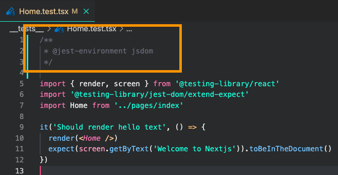

# learning-hasura

## 教材のリポジトリ

- https://github.com/GomaGoma676/nextjs-hasura-basic-lesson

## hasura

https://hasura.io/cloud/

github で認証を行い、heroku にも接続して DB を作成することにした。
kakikubo-hasura にしてみた。

# GraphQL スゲー

のだが、うまいこと纏められない。

- One to One(一対一)
- One to Many(一対多)
- Many to Many(多対多)

* query
* mutation

各種操作に関しては動画を参照しながらの方が良さそうだけどまとめられたらまとめる…。

# インストールする VS Code プラグイン

- [ES7 React/Redux/GraphQL/React-Native snippets
  ](https://marketplace.visualstudio.com/items?itemName=dsznajder.es7-react-js-snippets)
- [Jest](https://marketplace.visualstudio.com/items?itemName=Orta.vscode-jest)
- [Prettier](https://marketplace.visualstudio.com/items?itemName=esbenp.prettier-vscode)

# NextJs のセットアップ

- https://github.com/GomaGoma676/nextjs-hasura-basic-lesson/README.md を参照する

```bash
mkdir kakikubo-hasura
cd kakikubo-hasura
npx create-nest-app .
yarn dev
```

起動することを確認する。
以降は上記手順に譲る。

# 注意書き等

## ReferenceError document is not defined 対処法

https://www.udemy.com/course/hasura-nextjs-hasura-apollo-client-graphql-web/learn/lecture/27003596#overview

次のレクチャー 13:12 辺りでテストを実行する際に, document is not defined というエラーが発生するケースがありますので、その場合は以下の対処をお願い致します。

対処法 : テストファイルの先頭に下記 3 行のコメント文を追加

```js
/**
 * @jest-environment jsdom
 */
```



## [注意] Tailwind CSS ver3.0

Tailwind CSS ver3.0〜 Nextjs への設定方法が若干変更になりましたので、以下の対応をお願い致します。

・次の動画の 11:10 辺りで編集する purge 属性の代わりに以下の content 属性の設定を追記する。

tailwind.config.js ファイル

```js
module.exports = {
  content: [
    './pages/**/*.{js,ts,jsx,tsx}',
    './components/**/*.{js,ts,jsx,tsx}',
  ],
  theme: {
    extend: {},
  },
  plugins: [],
};
```

https://tailwindcss.com/docs/guides/nextjs
