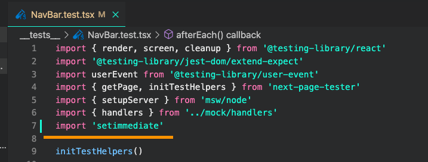
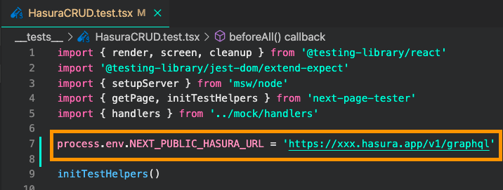

# learning-hasura

## 教材のリポジトリ

- https://github.com/GomaGoma676/nextjs-hasura-basic-lesson

## hasura

https://hasura.io/cloud/

github で認証を行い、heroku にも接続して DB を作成することにした。
kakikubo-hasura にしてみた。
[今回つくったプロジェクト kakikubo-hasura](https://cloud.hasura.io/project/240cecde-58ae-4f75-a05f-1a3fc5b098d6/console/api/api-explorer)

### hasura の endpoint を保護する方法

- JWT
- Hasura admin secret

いずれかを使う。 JWTでやるのが常。
今回はHasura admin secretを使う。
`.env.local`ファイルを作成して `NEXT_PUBLIC_HASURA_KEY="(Hasura Console で生成した値)"`
を指定しておいて作業をすすめる事にする。このファイル自体は `.gitignore`されているのでソースには反映されない。
そして`apolloClient.ts`に `process.env.NEXT_PUBLIC_HASURA_KEY`をheadersに`x-hasura-admin-secret`として読み込ませてあげる。
この状態で `yarn dev`で起動してみると、
```
ready - started server on 0.0.0.0:3000, url: http://localhost:3000
info  - Loaded env from /Users/kakikubo/Documents/learning-hasura/kakikubo-hasura/.env.local
info  - Using webpack 5. Reason: Enabled by default https://nextjs.org/docs/messages/webpack5
```

という表示がでてきちんとリクエストが処理されるようになる。
# GraphQL スゲー

のだが、うまいこと纏められない。

- One to One(一対一)
- One to Many(一対多)
- Many to Many(多対多)

* query
* mutation

各種操作に関しては動画を参照しながらの方が良さそうだけどまとめられたらまとめる…。

# インストールする VS Code プラグイン

- [ES7 React/Redux/GraphQL/React-Native snippets
  ](https://marketplace.visualstudio.com/items?itemName=dsznajder.es7-react-js-snippets)
- [Jest](https://marketplace.visualstudio.com/items?itemName=Orta.vscode-jest)
- [Prettier](https://marketplace.visualstudio.com/items?itemName=esbenp.prettier-vscode)

# NextJs のセットアップ

- https://github.com/GomaGoma676/nextjs-hasura-basic-lesson/README.md を参照する

```bash
mkdir kakikubo-hasura
cd kakikubo-hasura
```

### 1-1. yarn install *インストールしていない場合

```bash
npm install --global yarn
yarn --version
```

### 1-2.  create-next-app

```
npx create-next-app .
yarn dev
```
起動することを確認する。

#### Node.js version 10.13以降が必要です。 -> ターミナル `node -v`でver確認出来ます。
### 1-3.  Apollo Client + heroicons + cross-fetch のインストール

```
yarn add @apollo/client graphql @apollo/react-hooks cross-fetch @heroicons/react
```

### 1-4.  React-Testing-Library + MSW + next-page-tester のインストール

```
yarn add -D msw@0.35.0 next-page-tester jest @testing-library/react @types/jest @testing-library/jest-dom @testing-library/dom babel-jest @babel/core @testing-library/user-event jest-css-modules
```

### 1-5.  Project folder 直下に".babelrc"ファイルを作成して下記設定を追加

```
touch .babelrc
~~~
 {
     "presets": ["next/babel"]
 }
~~~
```

### 1-6.  package.json に jest の設定を追記

```
"jest": {
    "testPathIgnorePatterns": [
        "<rootDir>/.next/",
        "<rootDir>/node_modules/"
    ],
    "moduleNameMapper": {
        "\\.(css)$": "<rootDir>/node_modules/jest-css-modules"
    }
}
```

### 1-7.  package.jsonに test scriptを追記

```
"scripts": {
    ...
    "test": "jest --env=jsdom --verbose"
},
```

### 1-8.  prettierの設定 : settingsでRequire Config + Format On Saveにチェック

```
touch .prettierrc
```

```
{
    "singleQuote": true,
    "semi": true
}
```

## 2. TypeScript の導入

https://nextjs.org/learn/excel/typescript/create-tsconfig

### 2-1. 空のtsconfig.json作成

```
touch tsconfig.json
```

### 2-2. 必要moduleのインストール

```
yarn add -D typescript @types/react @types/node
```

### 2-3. 開発server起動

```
yarn dev
```

### 2-4. _app.js, index.js -> tsx へ拡張子変更

### 2-5. AppProps型追記

```
import { AppProps } from 'next/app'

function MyApp({ Component, pageProps }: AppProps) {
    return <Component {...pageProps} />
}

export default MyApp
```

## 3. Tailwind CSS の導入

https://tailwindcss.com/docs/guides/nextjs

### 3-1. 必要moduleのインストール

```
yarn add tailwindcss@latest postcss@latest autoprefixer@latest
```

### 3-2. tailwind.config.js, postcss.config.jsの生成

```
npx tailwindcss init -p
```

### 3-3. tailwind.config.jsのpurge設定追加

```
module.exports = {
  content: [
    './pages/**/*.{js,ts,jsx,tsx}',
    './components/**/*.{js,ts,jsx,tsx}',
  ],
  theme: {
    extend: {},
  },
  plugins: [],
};
```

### 3-4. globals.cssの編集

```
@tailwind base;
@tailwind components;
@tailwind utilities;
```

## 4. Test動作確認

### 4-1. `__tests__`フォルダと`Home.test.tsx`ファイルの作成

```
import { render, screen } from '@testing-library/react'
import '@testing-library/jest-dom/extend-expect'
import Home from '../pages/index'

it('Should render title text', () => {
  render(<Home />)
  expect(screen.getByText('Next.js!')).toBeInTheDocument()
})
```

### 4-2. yarn test -> テストがPASSするか確認

```
 PASS  __tests__/Home.test.tsx
  ✓ Should render hello text (20 ms)

Test Suites: 1 passed, 1 total
Tests:       1 passed, 1 total
Snapshots:   0 total
Time:        1.728 s, estimated 2 s
```

## 5. GraphQL codegen

### 5-1.  install modules + init

```
% yarn add -D @graphql-codegen/cli
% yarn graphql-codegen init
yarn run v1.22.11
$ /Users/kakikubo/Documents/learning-hasura/kakikubo-hasura/node_modules/.bin/graphql-codegen init
(node:34883) ExperimentalWarning: stream/web is an experimental feature. This feature could change at any time
(Use `node --trace-warnings ...` to show where the warning was created)

    Welcome to GraphQL Code Generator!
    Answer few questions and we will setup everything for you.
  
? What type of application are you building? Application built with React
? Where is your schema?: (path or url) https://kakikubo-hasura.hasura.app/v1/graphql
? Where are your operations and fragments?: queries/**/*.ts
? Pick plugins: TypeScript (required by other typescript plugins), TypeScript Operations (operations and fragments), TypeScript React Apollo (typed components and HO
Cs)
? Where to write the output: types/generated/graphql.tsx
? Do you want to generate an introspection file? No
? How to name the config file? codegen.yml
? What script in package.json should run the codegen? gen-types
.
.
% yarn
% yarn add -D @graphql-codegen/typescript
```

### 5-2.  add queries in queries/queries.ts file

### 5-3.  generate types automatically

```
yarn gen-types
```


# 注意書き等

## ReferenceError document is not defined 対処法

https://www.udemy.com/course/hasura-nextjs-hasura-apollo-client-graphql-web/learn/lecture/27003596#overview

次のレクチャー 13:12 辺りでテストを実行する際に, document is not defined というエラーが発生するケースがありますので、その場合は以下の対処をお願い致します。

対処法 : テストファイルの先頭に下記 3 行のコメント文を追加

```js
/**
 * @jest-environment jsdom
 */
```


## [注意] Tailwind CSS ver3.0

Tailwind CSS ver3.0〜 Nextjs への設定方法が若干変更になりましたので、以下の対応をお願い致します。

・次の動画の 11:10 辺りで編集する purge 属性の代わりに以下の content 属性の設定を追記する。

tailwind.config.js ファイル

```js
module.exports = {
  content: [
    './pages/**/*.{js,ts,jsx,tsx}',
    './components/**/*.{js,ts,jsx,tsx}',
  ],
  theme: {
    extend: {},
  },
  plugins: [],
};
```

https://tailwindcss.com/docs/guides/nextjs

## Nextjs ver12.0 + Next-page-tester互換性

現状(2021/11/3)、セクション4で使用するnext-page-testerがNextjs ver12に対応していない為、下記コマンドを実行して、Nextのversionを11系に変更してから講義を進めてください🙇‍♂️

```bash
yarn add next@11.1.2
```

## Nextjs ver11.0対応

Nextjs ver11.0対応で、次のレクチャーのLayout componentで下記修正をお願いいたします。

*コースのGitHubも修正済みです。

1. Layout componentに Imageのimport文追加

```js
import Head from "next/head";
import Link from "next/link";
import Image from "next/image";
```

2. をNextの<Image/>表記に変更

```html
<Image src="/vercel.svg" alt="Vercel Logo" width={72} height={16} />
```

## `ReferenceError: setImmediate is not defined` 対処法

Jest系のupdateの影響で、レクチャーのテスト実行時に2つのエラーが発生する可能性がありますので、遭遇した場合は下記手順で対処をお願い致します。

### `ReferenceError: document is not defined` 対処法

上述の通り(jsdom)

### `ReferenceError: setImmediate is not defined`

対処法:

1. setimmediate パッケージのインストール
  `yarn add setimmediate`
2. 各テストファイルのimport部に下記importを追加
  `import 'setimmediate'`


## [注意] env.test.localの読み込みエラー

レクチャー32(2022/01/12時点)の`Deploy to Vercel`の、2:08辺りで作成する .env.test.localの環境変数が上手く読み込まれないケースがあるので、Home.test.tsx以外の全てのテストファイルの import 直下に 下記環境変数を定義してからyarn testを実行してください。
```
process.env.NEXT_PUBLIC_HASURA_URL = 'https://xxx.hasura.app/v1/graphql'
```

url pathは各自のHasura URLに合わせて置き換えてください。

